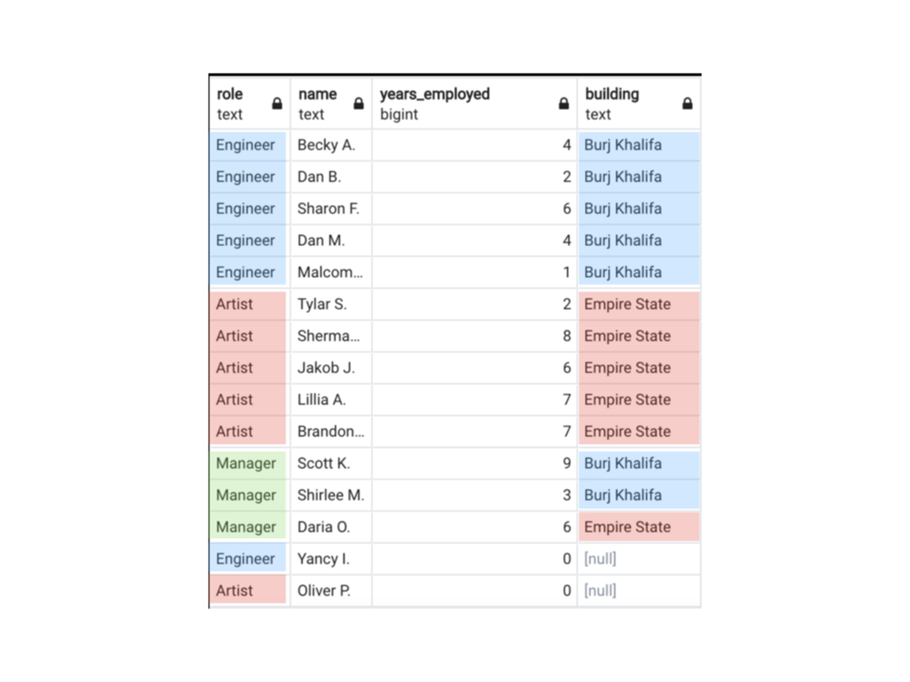

# Lab - Normalizing a Database

We'll start looking at a simple table. The employees table contains information about the role and name of an employee, how many years he/she is employed and the building he/she works.

However, there are several repeated information here. The image above shows the table's repetition. Of course for the example we're working on, it shouldn't matter that much, however, as the table gets bigger and bigger, it should be important to separate the table in smaller ones, hence optimizing storage space via the reduction of repeated information within a table - a process called normalization.

# Tasks

## 1. Let's start by creating that database.

### DATABASE CREATION.

Create a database called `company`.

> #### put your solution on a .sql file

### 1.1 TABLE CREATION.

Create the schema of the table called `employees`, i.e., use the `CREATE TABLE` statement (DDL) that describes how this table will be created.

> #### put your solution on a .sql file

### 1.2 INSERT VALUES.

INSERT the values for all the rows using the `INSERT INTO` statement.

> #### put your solution on a .sql file

## 2. Normalizing the table.

### 2.1 CREATING SECONDARY TABLES.

Next, our task will be to associate the strings with an id. Let's start with the `role` column. Create a new table called `role_info` on your database (using the CREATE TABLE statement) containing information of the `role_id` and `role_name` associating each unique `role_name` with a `role_id`. How is the `role_id` called on the `role_info` table? 

> #### put your solution on a .sql file

### 2.2 CREATING THE BUILDING INFORMATION.

Perform the same operations for the `building` column. Create a table called `building_info` containing `building_id` and `building_name`. Look for these buildings height, create a `height` column on this new table and insert their values with an `INSERT INTO` statement.

> #### put your solution on a .sql file

## 3. Updating the original table.

### 3.1 UPDATE ORIGINAL TABLE

Now that we've created our tables containing the least amount of repetition as possible, it's time to update the results of the original table. Use an `UPDATE table WHERE ...` statement to refresh the original `employees` table with the corresponding `ids`.

> #### put your solution on a .sql file

## 4. What if we wanted to bring back all information? 

This is the way the tables would probably be at your company's database. 

### 4.1 DRAW THE RELATIONSHIP DIAGRAM
Draw (you can use some [Database Diagram Tool](https://app.quickdatabasediagrams.com/#/)) the relationship diagram for the tables you've created, that is, how are your keys related within tables. Learn more about ERD (Entity Relationship Diagram) and cardinality styles [here](https://www.smartdraw.com/entity-relationship-diagram/) in order to create a well described database.

### 4.2 BRING RESULTS BACK

Using the information you've drawn, join the tables to bring information of the `role_name`, `building_name` and `height` of the building into a single table back again.

> #### put your solution on a .sql file

